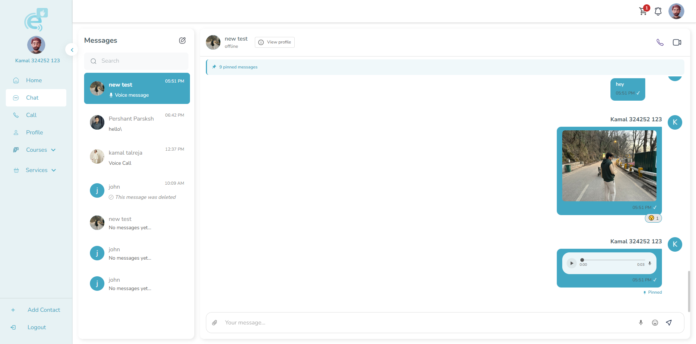
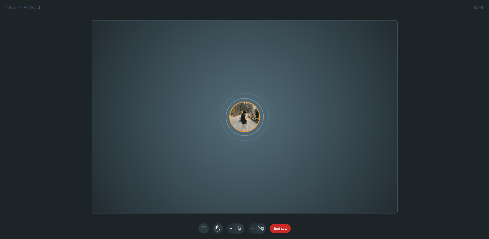
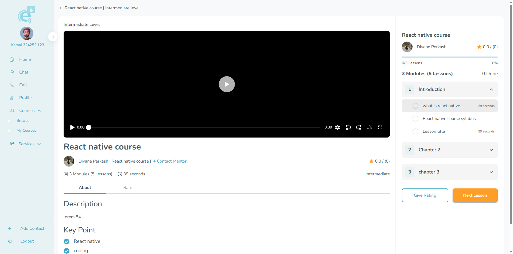
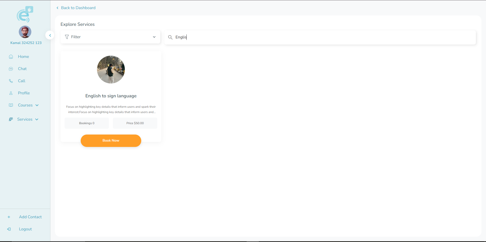

# EchoTalk
A real-time accessibility-focused communication platform designed to help people with hearing and speech disabilities communicate effectively through a simple, fast, and inclusive web interface.

# Project Description
EchoTalk is a web application designed to improve communication accessibility for individuals with hearing and speech impairments. It provides a clean and intuitive chat-based interface that enables real-time interaction between users, making communication more inclusive, natural, and barrier-free.

The platform is not limited to messaging — it is a complete communication ecosystem that includes courses, services, real-time chat, and video calling capabilities.

- Real-time Chat System for instant communication  
- Video & Audio Calling for face-to-face interaction  
- Courses Module to support learning and accessibility education  
- Services System for user-based support features  
- Sign Language Detection in Video Calls (AI-powered feature)  

# System Architecture

EchoTalk follows a scalable client-server architecture designed for real-time communication and accessibility features.

Frontend (Next.js + MUI) handles UI rendering, user interactions, and client-side state management
Backend (NestJS) manages APIs, authentication, business logic, and system workflows
PostgreSQL is used for persistent and relational data storage
Docker is used to containerize backend services and simplify deployment
Socket.IO powers real-time communication for chat, live messaging, and instant updates
Agora RTC is used for real-time audio/video calling functionality
Real-time AI Layer supports sign language gesture detection during video calls

# Tech stack
🖥️ Frontend
Next.js
Material UI (MUI)
⚙️ Backend
NestJS
PostgreSQL
Docker (for containerization)

# Project Setup
1. Clone Backend Repository
git clone <backend-repo-url>

2. Start Backend using Docker
cd backend
Make sure Docker is installed and running.
docker compose up --build

This will:

Set up backend server
Initialize PostgreSQL database
Run all required services
💻 3. Setup Frontend

Open a new terminal:
1. Clone Frontend Repository
git clone <Frontend-repo-url>

2. Start frontend
cd frontend
npm install
npm run dev
🌐 Running the Project

Once both services are running:

Frontend: http://localhost:3000
Backend: http://localhost:5000

# Authentication & Security
Secure JWT-based authentication for user login and session management
Access Token & Refresh Token system for improved security and session persistence
Role-Based Access Control (RBAC) to manage different user permissions (e.g., users, trainers, admins)
Protected API routes ensuring only authorized users can access sensitive resources
Passwords are securely hashed and salted before storage using industry-standard encryption
Token verification middleware to validate and secure all authenticated requests

#  Key Features
- 💬 Real-time Chat System for instant communication between users  
- 📞 Video & Audio Calling for seamless face-to-face interaction  
- 📚 Courses Module to support learning and accessibility awareness  
- 🛠️ Services System allowing users to book professional trainers for sign language learning and accessibility support  
- 🧏 AI-powered Sign Language Detection during video calls  
  (detects hand gestures and transmits them to the other user in real-time)  

#  Chat Interface

#  Call

# Course

# Service

# 👨‍💻 Author
**Pershant Parkash**  
Full Stack Developer  
GitHub: https://github.com/PershantParkash
